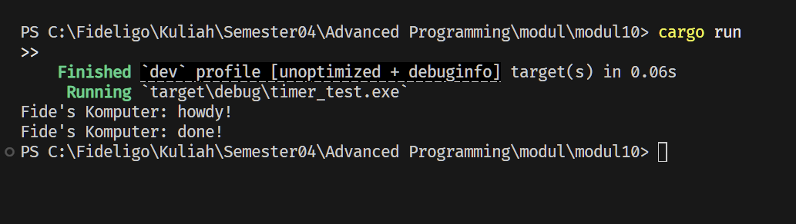
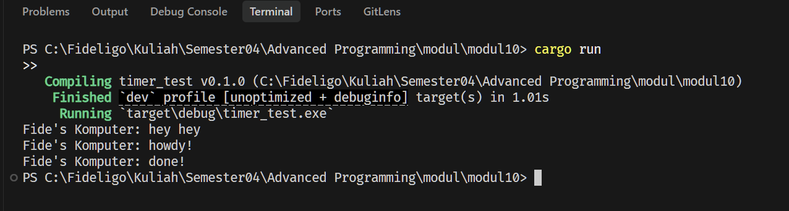
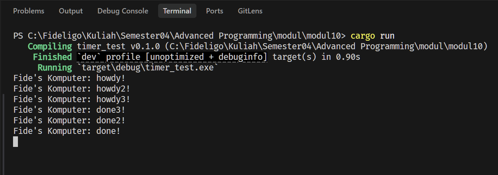
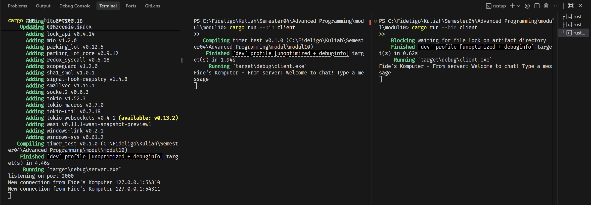
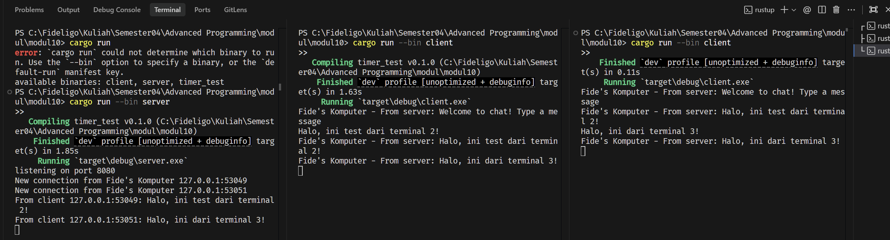
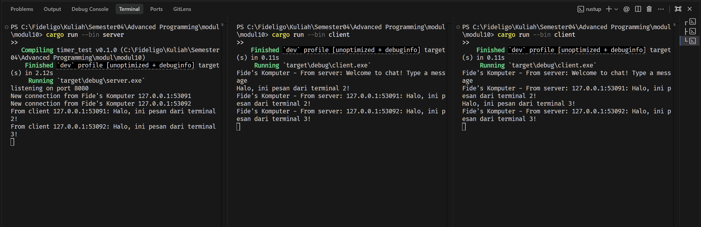
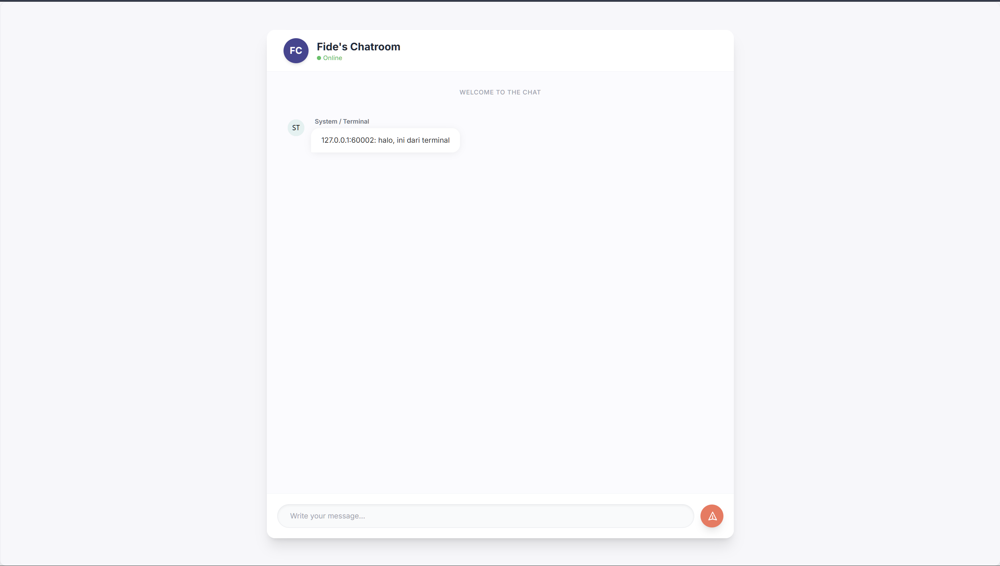
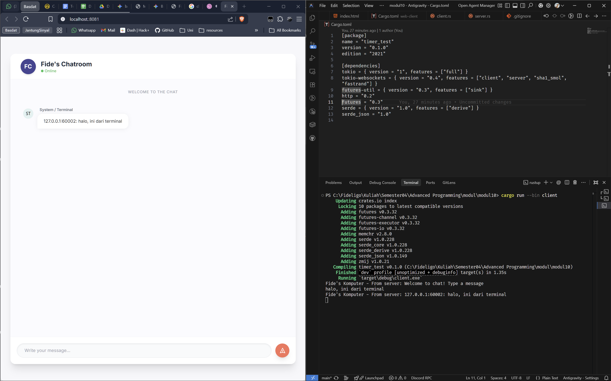

# Modul 10: Asynchronous Programming

**Nama:** Fideligo  
**NPM:** 2406495703  
**Mata Kuliah:** Advanced Programming

---

## Tutorial 1: Custom Async Executor & Timer

Pada Tutorial 1, dilakukan implementasi dari dasar (*from scratch*) sebuah mesin eksekutor asinkron (*asynchronous executor*) menggunakan pustaka `futures` standar Rust, tanpa menggunakan *runtime* eksternal seperti Tokio. Tujuannya adalah untuk memahami mekanisme internal dari pemrograman asinkron Rust di tingkat yang paling fundamental.

### Experiment 1.1: Timer Future Asli dari Buku

Eksperimen ini mengimplementasikan `TimerFuture` sesuai dengan contoh pada buku Rust Async Book (Chapter 2.3). Komponen utama yang diimplementasikan meliputi: struct `TimerFuture` yang mengimplementasikan trait `Future`, struct `SharedState` yang dibungkus `Arc<Mutex<...>>` untuk berbagi data lintas *thread* secara aman, serta komponen `Executor` dan `Spawner` yang berkomunikasi melalui *channel* `sync_channel` dari modul `std::sync::mpsc`. Ketika `TimerFuture::new(duration)` dipanggil, ia serta-merta men-*spawn* sebuah *thread* OS baru yang tidur selama durasi yang ditentukan; setelah tidurnya selesai, *thread* tersebut mengubah *flag* `completed` menjadi `true` dan memanggil `waker.wake()` untuk memberitahu *executor* bahwa *future* ini siap untuk di-*poll* kembali. Mekanisme `poll` pada `TimerFuture` bekerja dengan cara: jika `completed` sudah `true`, ia mengembalikan `Poll::Ready(())`; sebaliknya, ia menyimpan salinan `Waker` dari `Context` yang diterimanya ke dalam `shared_state`, lalu mengembalikan `Poll::Pending` sebagai sinyal bahwa pekerjaan belum selesai. Pola *handshake* antara `poll` yang mengembalikan `Pending` dan `waker.wake()` yang dipanggil dari *thread* timer inilah yang merupakan inti dari model konkurensi *cooperative* di Rust, di mana sebuah *future* tidak memblokir *thread* eksekutor melainkan menyerahkan kontrol kembali dan akan "dibangunkan" saat data tersedia.

---

### Experiment 1.2: Memahami Urutan Polling

Eksperimen ini bertujuan untuk menganalisis secara mendalam bagaimana `Executor` berinteraksi dengan `Task` dan `Waker`. Siklus hidup sebuah tugas dalam eksekutor kustom ini dimulai ketika `Spawner::spawn()` dipanggil: ia membungkus *future* ke dalam sebuah `Task` (yang dibungkus `Arc<Task>`) dan mengirimkannya ke dalam *channel* `ready_queue`. `Executor::run()` kemudian mengambil `Task` dari *channel* tersebut menggunakan `ready_queue.recv()` yang bersifat *blocking*, kemudian membuat `Waker` menggunakan `waker_ref(&task)` — memanfaatkan trait `ArcWake` yang diimplementasikan oleh `Task`. Implementasi `ArcWake::wake_by_ref` pada `Task` sangatlah krusial: ketika dipanggil oleh *thread* timer, ia mengkloning `Arc<Task>` itu sendiri dan mengirimkan klonannya kembali ke dalam `task_sender`, yang menyebabkan tugas tersebut antri ulang di `ready_queue` dan siap untuk di-*poll* lagi oleh `Executor`. Jika setelah di-*poll* hasilnya masih `Poll::Pending`, `Executor` mengembalikan `future` kembali ke dalam `future_slot` (opsi `Some(future)`) agar tidak ter-*drop*; jika `Poll::Ready`, *slot* dibiarkan `None` sehingga *future* ter-*drop* secara alami. Pola ini memastikan tidak ada memori yang bocor dan siklus hidup setiap *task* dikelola secara deterministik oleh *ownership* sistem Rust.

---

### Experiment 1.3: Multiple Spawn dan Efek `drop(spawner)`

Pada eksperimen ini, tiga buah *task* di-*spawn* secara bersamaan untuk mendemonstrasikan konkurensi kooperatif. Karena `Executor` berjalan pada satu *thread* tunggal dan memproses *task* satu per satu dari *channel*, ketiga *task* tersebut dieksekusi secara *interleaved*: `howdy!`, `howdy2!`, `howdy3!` muncul hampir bersamaan karena ketiganya di-*poll* pertama kali sebelum satupun dari mereka yang mengembalikan `Ready`. Setelah masing-masing `TimerFuture` (berdurasi 2 detik) habis, `waker.wake()` dipanggil dari tiga *thread* OS yang berbeda, menyebabkan ketiga *task* kembali masuk ke antrian `ready_queue` hampir secara simultan. Eksperimen juga menyelidiki efek dari menghilangkan `drop(spawner)`: tanpa `drop(spawner)` yang eksplisit, referensi `SyncSender` dalam `Spawner` tetap hidup, sehingga *channel* tidak pernah ditutup, dan `ready_queue.recv()` di dalam `Executor::run()` akan memblokir selamanya setelah semua *task* selesai — menyebabkan program *hang* tanpa batas. Dengan memanggil `drop(spawner)` secara eksplisit, kita memastikan bahwa semua `SyncSender` telah di-*drop*, yang menyebabkan *channel* tertutup dan `recv()` mengembalikan `Err`, sehingga `Executor::run()` keluar dari *loop* dan program selesai dengan bersih.

---

## Tutorial 2: Broadcast WebSocket Chat

Pada Tutorial 2, diimplementasikan aplikasi ruang obrolan (*chat room*) berbasis WebSocket menggunakan `tokio` sebagai *runtime* asinkron dan `tokio_websockets` sebagai pustaka WebSocket. Arsitektur yang digunakan adalah model *broadcast*: satu server yang dapat menangani banyak klien secara bersamaan, di mana setiap pesan dari satu klien disebarkan ke seluruh klien yang terhubung.

### Experiment 2.1: Kode Asli dan Cara Menjalankannya

Eksperimen ini adalah implementasi awal dari sistem *broadcast chat*. Pada sisi server, digunakan `tokio::sync::broadcast::channel(16)` untuk membuat sebuah *channel* siaran (*broadcast channel*) dengan kapasitas 16 pesan dalam buffer. *Channel* ini menggunakan pola *Multiple Producer, Multiple Consumer* (MPMC) di mana terdapat satu `Sender` yang dapat di-*clone* dan banyak `Receiver` yang masing-masing merupakan salinan independen. Setiap kali klien baru terhubung, `bcast_tx.subscribe()` dipanggil untuk membuat `Receiver` baru khusus untuk koneksi tersebut, dan `tokio::spawn(...)` digunakan untuk menjalankan fungsi `handle_connection` di dalam *task* asinkron yang terpisah — memungkinkan server menangani ribuan koneksi secara konkuren tanpa memerlukan satu *thread* OS per koneksi. Di dalam *loop* `handle_connection`, `tokio::select!` digunakan untuk memantau dua sumber kejadian (*event*) secara bersamaan: pesan masuk dari klien melalui WebSocket (`ws_stream.next()`) dan pesan yang perlu diteruskan ke klien dari *broadcast channel* (`bcast_rx.recv()`). Makro `tokio::select!` ini adalah jantung dari arsitektur konkuren Tokio: ia memblokir *task* secara asinkron hingga salah satu dari *branch*-nya siap, tanpa memblokir *thread* OS yang mendasarinya.

---

### Experiment 2.2: Modifikasi Port

Eksperimen ini mendemonstrasikan fleksibilitas konfigurasi server dengan mengubah port *binding* dari port awal menjadi **8080**. Perubahan ini dilakukan pada baris `TcpListener::bind("127.0.0.1:8080")` di dalam fungsi `main` server. Penggunaan `TcpListener` dari `tokio::net` (bukan dari `std::net`) adalah hal yang krusial karena operasi `.bind()` dan `.accept()` pada versi Tokio bersifat asinkron (*non-blocking*), sehingga server dapat terus menunggu koneksi baru tanpa mengonsumsi CPU secara aktif. Ketika `listener.accept().await?` mengembalikan koneksi baru, `tokio::spawn(...)` segera dipanggil untuk mendelegasikan penanganan koneksi tersebut ke *task* baru, sementara *loop* utama langsung kembali menunggu koneksi berikutnya. Port 8080 dipilih sebagai standar karena sesuai dengan konvensi umum untuk server WebSocket berbasis HTTP dalam lingkungan pengembangan, dan sekaligus mempersiapkan integrasi dengan klien web Yew pada Tutorial 3. Screenshot membuktikan bahwa server berhasil menampilkan pesan `listening on port 8080` dan klien berhasil terhubung serta bertukar pesan, memvalidasi bahwa perubahan konfigurasi jaringan bekerja dengan sempurna.

---

### Experiment 2.3: Menambahkan Informasi IP dan Port Pengirim

Eksperimen ini meningkatkan fungsionalitas *broadcast* dengan menambahkan identitas pengirim secara otomatis pada setiap pesan. Perubahan kunci ada pada logika pemrosesan pesan di `handle_connection`: alih-alih langsung meneruskan teks mentah dari klien, server kini memformat ulang pesan menjadi `format!("{}: {}", addr, text)`, di mana `addr` adalah `SocketAddr` yang merepresentasikan alamat IP dan nomor port unik dari klien pengirim. Nilai `SocketAddr` ini diperoleh secara otomatis dari hasil `listener.accept().await?` yang mengembalikan tuple `(TcpStream, SocketAddr)`, tanpa memerlukan mekanisme otentikasi atau registrasi nama pengguna apapun. Dengan demikian, setiap klien dalam sistem ini memiliki identitas unik yang dijamin oleh sistem operasi melalui kombinasi IP:Port, yang tidak mungkin terduplikasi dalam satu waktu. Ketika pesan yang telah diformat tersebut dikirimkan melalui `bcast_tx.send(formatted_msg)?`, seluruh subscriber *broadcast channel* — termasuk pengirim aslinya — akan menerima pesan tersebut kembali, sehingga setiap klien dapat melihat riwayat obrolan lengkap beserta informasi pengirimnya secara *real-time*.

---

## Tutorial 3: WebChat Berbasis Yew (WebAssembly)

Pada Tutorial 3, dibangun antarmuka pengguna berbasis *web* menggunakan *framework* **Yew**, yang memungkinkan penulisan kode Rust yang dikompilasi menjadi **WebAssembly (WASM)** dan dijalankan langsung di *browser*. Proyek ini berada di subfolder `web-client/` dan dikelola menggunakan `trunk` sebagai *bundler* dan *dev server*.

### Experiment 3.1: Kode Asli Klien Web

Eksperimen ini membangun fondasi klien web dengan menggunakan komponen fungsi Yew (`#[function_component(App)]`). Koneksi WebSocket ke server Rust diinisialisasi menggunakan `gloo_net::websocket::WebSocket::open("ws://127.0.0.1:8080")` di dalam *hook* `use_effect_with((), ...)`, yang dipanggil hanya sekali setelah komponen pertama kali di-*render* — setara dengan `componentDidMount` pada React. *WebSocket* kemudian di-*split* menjadi dua *half* menggunakan `.split()`: `write` (untuk mengirim pesan) dan `read` (untuk menerima pesan). Karena kepemilikan (*ownership*) `write` harus dibawa masuk ke dalam *task* asinkron yang berumur `'static`, digunakan sebuah `futures::channel::mpsc::channel` sebagai perantara: komponen menyimpan `Sender` (`tx`) dalam *state* dan mengirimkannya ke *task* yang menguasai `write`, sehingga komponen dapat mengirim pesan tanpa perlu memegang referensi langsung ke `write`. *State* reaktif seperti `messages` dan `input_value` dikelola menggunakan *hook* `use_state`, dan setiap pembaruan *state* akan memicu Yew untuk me-*re-render* komponen secara otomatis — sebuah paradigma *reactive UI* yang serupa dengan React tetapi ditulis sepenuhnya dalam Rust.

---

### Experiment 3.2: Kreativitas Antarmuka (*Be Creative!*)

Pada eksperimen ini, antarmuka pengguna dirombak secara signifikan untuk menciptakan pengalaman pengguna (*UX*) yang modern dan profesional menggunakan **Tailwind CSS** (dimuat via CDN) dengan palet warna kustom. Palet warna yang digunakan terinspirasi dari desain aplikasi *chat* profesional: ungu tua `#434293` (`brand-purple`) untuk elemen branding utama, merah-oranye `#ff725a` (`brand-coral`) untuk tombol aksi (*call-to-action*), dan putih bersih untuk area konten. Antarmuka dirancang sebagai *pure chatroom* — tanpa *sidebar* navigasi atau kolom daftar kontak yang menyesatkan — sehingga fokus pengguna tertuju pada satu hal: percakapan. *Chat bubble* dibedakan secara visual berdasarkan identitas pengirim: pesan yang dikirim oleh pengguna saat ini (`Fide's WebChat`) ditampilkan di sisi kanan dengan warna `brand-purple`, sementara pesan dari pengguna lain ditampilkan di sisi kiri dengan warna putih beserta avatar dan nama pengirimnya. Konfigurasi Tailwind disuntikkan langsung melalui blok `` di `index.html`, memungkinkan penggunaan nama kelas kustom (`bg-brand-purple`, `bg-brand-coral`) tanpa memerlukan *build tool* Node.js tambahan.

---

## Bonus: Interoperabilitas Server (Terminal CLI ↔ Browser Yew)

Fitur bonus ini merupakan pencapaian teknis paling kompleks dalam modul ini: memodifikasi server Rust agar dapat secara *transparan* menangani dua format pesan yang berbeda secara simultan — **teks biasa** dari klien terminal CLI dan **JSON** dari klien browser Yew. Perubahan kunci ada pada struct `ChatMessage` yang di-*derive* `Serialize` dan `Deserialize` dari `serde`, serta logika pemrosesan pesan di `handle_connection` yang menggunakan pendekatan *try-parse with fallback*: server pertama-tama mencoba melakukan deserialisasi *string* masuk menggunakan `serde_json::from_str::<ChatMessage>(text)`, dan jika berhasil, server menambahkan informasi `addr` ke dalam *field* `username` sebelum melakukan serialisasi kembali menjadi JSON untuk disiarkan; namun jika *parsing* gagal (artinya pesan tersebut adalah teks biasa dari terminal), server memformat pesan tersebut dengan cara lama menggunakan `format!("{}: {}", addr, text)`. Di sisi klien Yew, logika simetris diterapkan: ketika pesan diterima dari server, klien mencoba melakukan *parse* JSON; jika berhasil, ia menggunakan *field* `username` dan `content` untuk merender *chat bubble* yang informatif; jika gagal (pesan dari klien terminal), ia membungkus teks tersebut ke dalam sebuah objek `ChatMessage` sementara dengan `username: "System / Terminal"`, memastikan *layout* tetap konsisten. Mekanisme *dual-protocol* ini memungkinkan heterogenitas klien dalam satu jaringan *chat* yang sama tanpa memerlukan negosiasi protokol eksplisit, melainkan cukup dengan *pattern matching* sederhana di sisi server.
